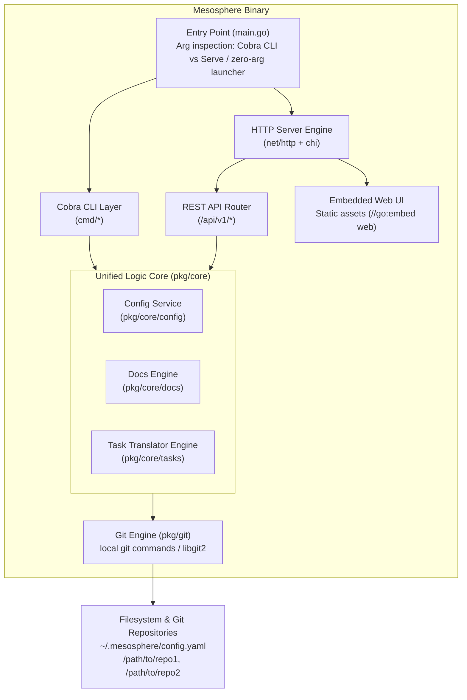

# Mesosphere Technical Design

## 1. Design Summary

Mesosphere is a single-binary, unified-architecture application written in **Go**. It serves as a lightweight, git-native product management tool that unifies CLI commands, an embedded REST API, and an embedded web UI serving static assets. 

### Architectural Core Principles
1. **Single Compiled Binary with Zero External Runtime Dependencies**: Built with Go, producing a standalone executable containing CLI commands (Cobra), embedded HTTP server (`net/http`), and compile-time embedded static web assets (`//go:embed`).
2. **Dual-Mode Execution**:
   - **CLI Mode**: Executes explicitly passed commands/subcommands (e.g. `mesosphere analyze`, `mesosphere repo list`, `mesosphere doc get <doc-id>`) directly in terminal stdout/stderr.
   - **Serve Mode**: Executed with `serve` or launched with zero arguments (e.g., GUI double-click), launches the embedded HTTP backend on localhost and automatically opens the user's default system browser to `http://localhost:[port]`.
3. **Unified Core Logic Layer**: All business logic (git interactions, configuration management, markdown parsing, document listing/versioning, and task file translation) is encapsulated in pure Go packages in `/pkg/core`. Both the CLI handlers and the HTTP REST API controllers wrap the exact same core function signatures.
4. **Git-Native System of Record**: All documents and task files reside directly within version-controlled git repositories on the local filesystem. Save operations perform local git commits; Publish operations execute `git pull` followed by `git push`.
5. **Pluggable Common Task Translation**: Translates disparate task schemas (GitHub Spec Kit, OpenSpec, BMAD-METHOD, etc.) into a unified internal task representation (`CardID`, `Scope`, `ValidationGate`, `isBlocked`, `status`, `blockerID`).

---

## 2. Architecture & Component Boundaries

### High-Level Architecture Diagram



### Subsystems & Responsibilities

1. **CLI Layer (`/cmd`)**: Built using `spf13/cobra`. Handles CLI flags, terminal formatting, stderr/stdout output, exit codes, and invocation of Core API methods.
2. **Server Engine (`/pkg/server`)**: Standard library `net/http` router (using lightweight `go-chi/chi`). Serves REST endpoints (`/api/v1/...`) and routes fallback `/` requests to embedded static UI files (`web/dist`). Handles browser auto-launch (`pkg/browser`).
3. **Embedded UI Assets (`/web`)**: A single-page application (Vue.js/React/Svelte or Vanilla JS compiled into static HTML/CSS/JS with relative asset linking). Pre-compiled during binary build and embedded into the Go binary using `//go:embed`.
4. **Unified Business Logic Core (`/pkg/core`)**:
   - `config`: Discovers, loads, validates, and writes `~/.mesosphere/config.yaml`.
   - `docs`: Discovers markdown/text files, retrieves version history via git, parses markdown, and saves document edits.
   - `tasks`: Discovers task files, detects schema, translates framework-specific schemas into `CommonTask`, maps board columns, updates task JSON/YAML.
   - `git`: Wraps git operations (commit, push, pull, fetch, diff, commit log, remote status).
5. **Agent Skill Definition (`.agents/skills/mesosphere-cli/SKILL.md`)**: Exposes structured capabilities and CLI commands to external AI agents.

---

## 3. Runtime / Execution Flow

### 3.1 Binary Launch Resolution Flow
```
[User / OS Invocation]
        |
        v
Does os.Args contain commands/flags?
        |
        +---> [YES: Specific subcommand passed, e.g., 'mesosphere doc list']
        |           |
        |           v
        |     Execute Cobra Subcommand -> Call pkg/core -> Print to Stdout/Stderr -> Exit(0/1)
        |
        +---> [NO: Zero arguments passed (GUI Double-Click or naked CLI)] OR command is 'mesosphere serve'
                    |
                    v
              1. Initialize pkg/core Service Engine
              2. Bind HTTP Server to localhost on specified or random free port (default 8080)
              3. Trigger openBrowser("http://localhost:8080")
              4. Listen and serve HTTP traffic indefinitely (until SIGINT/SIGTERM)
```

### 3.2 Dual-Mode Unified Logic Invocation

```
CLI Path:
User runs CLI command  -->  Cobra Handler  --+
                                             |
                                             +--> pkg/core API Function  -->  Git Engine / Disk
                                             |
Web UI Path:                                 |
Browser fetch request  -->  REST Controller  -+
```

### 3.3 Remote Sync & Publish Flow (Save & Publish Sequence)

```
[Web UI / User Action]
       |
       +---> Action: "Save Document" or "Save Task"
       |        |
       |        v
       |     Write updated raw file to disk in local repo
       |     Git Engine: git add <filepath> && git commit -m "update(mesosphere): <filename>"
       |     Return success response to UI (Sets UI state: "Unpublished local changes present")
       |
       +---> Action: "Publish"
                |
                v
             1. UI sets Publish button state: Disabled + Spinning Feedback
             2. Git Engine: git pull --rebase (or standard pull)
             3. If conflict detected:
                - Return HTTP 409 Conflict error with conflict details
                - UI displays error notification: "Git conflict detected. Please resolve manually in repo."
             4. Git Engine: git push
             5. UI sets Publish button state: Enabled + Clear "Unpublished changes" badge
```

### 3.4 Background Fetch Flow
- HTTP Server maintains a ticker every 3 minutes per active configured repository.
- Executes `git fetch origin` in background.
- Compares local `HEAD` with `origin/<branch>`.
- UI polls `/api/v1/repos/{id}/status` or listens via Server-Sent Events (SSE) / WebSocket.
- If upstream changes exist, top-left Refresh icon appears in UI. Clicking Refresh triggers `git pull` and updates the active view.

---

## 4. State Model

### System & Interface States

| Component | State Name | Meaning | Transitions / Triggers |
| :--- | :--- | :--- | :--- |
| **UI Publish Button** | `Idle / Hidden` | No unpushed local commits exist. | Initial state or after successful Publish. |
| | `HasUnpublished` | Local commit made via Save operation. | Transitions when Save succeeds. |
| | `Publishing` | `git pull` & `git push` in progress. | Disabled + Spinner. Triggered on click. |
| | `ConflictError` | `git pull` encountered conflicts. | Displays error modal/alert. Requires manual resolution or retry. |
| **Repo Sync State**| `InSync` | Local HEAD matches upstream tracking branch. | Default after fetch/pull. |
| | `Behind` | Upstream has new commits detected by background `git fetch`. | Top-left Refresh icon becomes visible. |
| | `Fetching` | Background `git fetch` running. | Runs every 3 minutes non-blocking. |
| **Split View** | `SinglePane` | Standard single repo/view mode. | Default view on application startup. |
| | `DualPane` | View split into two independent viewports. | User clicks "Split View". Orientation dynamically set by CSS viewport aspect ratio (`width > height ? row : column`). |

---

## 5. Data Models & Schemas

### 5.1 Configuration Schema (`~/.mesosphere/config.yaml`)

```yaml
version: "1.0"
settings:
  server:
    port: 8080
    auto_open_browser: true
  ui:
    active_tab: "docs" # docs | tasks
    split_view_enabled: false
    panes:
      - repo_id: "mesosphere-main"
        mode: "docs" # docs | tasks
        active_doc_path: "docs/architecture.md"
      - repo_id: "mesosphere-main"
        mode: "tasks"
repositories:
  - id: "mesosphere-main"
    name: "Mesosphere Main Repo"
    path: "/path/to/local/repo"
    remote_url: "git@github.com:org/repo.git"
    credentials:
      ssh_key_path: "~/.ssh/id_rsa"
      # or token: "env:GITHUB_TOKEN"
  - id: "secondary-repo"
    name: "Secondary Project"
    path: "/path/to/another/repo"
```

### 5.2 Unified Internal Task Schema (`pkg/core/tasks/model.go`)

Regardless of the source task schema (e.g. GitHub Spec Kit, OpenSpec, BMAD-METHOD, Jira-compatible JSON, markdown checkboxes), the Task Translator parses the native file into this canonical Go struct:

```go
type CommonTask struct {
	CardID         string                 `json:"card_id"`          // Unique task identifier (e.g., "TASK-101")
	Title          string                 `json:"title"`            // Short title/summary
	Scope          string                 `json:"scope"`            // Scope text rendered on card
	ValidationGate string                 `json:"validation_gate"` // Acceptance criteria / gate condition
	IsBlocked      bool                   `json:"is_blocked"`       // Blocked status flag
	BlockerID      map[string]            `json:"blocker_ids"`       // IDs of blocking tasks (if blocked)
	Status         string                 `json:"status"`           // Framework status string (e.g., "TO DO", "IN PROGRESS", "DONE")
	RawContent     string                 `json:"raw_content"`      // Original full JSON/YAML string
	FilePath       string                 `json:"file_path"`        // Path relative to repository root
	RepoID         string                 `json:"repo_id"`          // Owning repo ID
	ExtraFields    map[string]interface{} `json:"extra_fields"`     // Preserved framework-specific fields
}
```

### 5.3 Kanban Column Derive Rule

- **Binary / Checkbox Schema**: Automatically maps to exactly 2 columns: `["TO DO", "DONE"]`.
- **Explicit Status Schema**: Creates 1 column per unique `Status` value present in the schema definition or tasks.
- **`IsBlocked == true` Handling**: Task remains in the `"TO DO"` column, displaying a red/warning blocked indicator icon with hover tooltips listing `BlockerID`. It NEVER creates a separate `"BLOCKED"` column.

---

## 6. Interfaces & Contracts

### 6.1 Unified Core Interface (`pkg/core/core.go`)

Both CLI and HTTP REST API handlers interact exclusively with this Go interface:

```go
type CoreEngine interface {
	// Config Operations
	GetConfig(ctx context.Context) (*Config, error)
	UpdateConfig(ctx context.Context, cfg *Config) error

	// Repository Operations
	ListRepositories(ctx context.Context) ([]Repository, error)
	GetRepositoryContext(ctx context.Context, cwd string, repoFlag string) (*Repository, error)
	GetRepoStatus(ctx context.Context, repoID string) (*RepoStatus, error)
	SyncRepository(ctx context.Context, repoID string) error // git pull
	PublishRepository(ctx context.Context, repoID string) error // git pull + push

	// Document Operations
	ListDocuments(ctx context.Context, repoID string) ([]DocumentSummary, error)
	GetDocument(ctx context.Context, repoID string, docPath string, version string) (*DocumentDetail, error)
	ListDocumentVersions(ctx context.Context, repoID string, docPath string) ([]CommitVersion, error)
	SaveDocument(ctx context.Context, repoID string, docPath string, content string, commitMsg string) error

	// Task Operations
	ListTasks(ctx context.Context, repoID string) ([]CommonTask, error)
	GetTask(ctx context.Context, repoID string, taskID string) (*CommonTask, error)
	SaveTask(ctx context.Context, repoID string, taskID string, rawJSON string, commitMsg string) error
}
```

### 6.2 Internal REST API Endpoints (`/api/v1`)

All endpoints return JSON and use standard HTTP status codes (200, 400, 404, 409 for git conflicts, 500).

- `GET /api/v1/config` -> Get active configuration & UI state.
- `POST /api/v1/config` -> Update active configuration & UI state.
- `GET /api/v1/repos` -> List configured repositories.
- `GET /api/v1/repos/{repoID}/status` -> Get repo status (uncommitted local changes, behind count).
- `POST /api/v1/repos/{repoID}/publish` -> Perform `git pull` then `git push`.
- `POST /api/v1/repos/{repoID}/sync` -> Perform `git pull`.
- `GET /api/v1/repos/{repoID}/docs` -> List markdown/text documents in repo.
- `GET /api/v1/repos/{repoID}/docs/detail?path={path}&version={commitHash}` -> Get document content (optional version).
- `GET /api/v1/repos/{repoID}/docs/versions?path={path}` -> List git commit history for document.
- `POST /api/v1/repos/{repoID}/docs/save` -> Update document file content and trigger git commit.
- `GET /api/v1/repos/{repoID}/tasks` -> List converted tasks for repo.
- `GET /api/v1/repos/{repoID}/tasks/{taskID}` -> Get specific task detail and raw JSON.
- `POST /api/v1/repos/{repoID}/tasks/{taskID}/save` -> Update task raw JSON and trigger git commit.

---

## 7. Persistence & Recovery

1. **Git as Sole System of Record**:
   - No external SQL/NoSQL database. All operational state (docs, tasks, history) resides directly in git repos.
   - Any save operation writes to the filesystem and performs an immediate git commit with an automated message (`"mesosphere(doc): update path/to/doc.md"`).
2. **Configuration Persistence**:
   - Persisted in `~/.mesosphere/config.yaml`.
   - Updated whenever user changes repos, active tabs, or split view arrangements.
3. **Recovery Behavior**:
   - If a `git push` fails due to remote changes, the system performs a `git pull --rebase`.
   - If merge conflicts occur during pull, git leaves conflict markers, returns HTTP 409 / CLI Error, and halts the operation cleanly without corrupting the workspace.

---

## 8. Frontend Architecture & Static Asset Embedding

### Feature 1, 2 & 3 Compliance Implementation Details

1. **Build Step**:
   - The frontend (`/web`) is built using standard web technologies (e.g. HTML5, Tailwind CSS, Vue/React/Vanilla JS) compiled down to standard static assets in `web/dist/`.
   - All build asset links use relative paths (`./assets/...`) to support embedded hosting under root `/`.
2. **Embedding (`pkg/server/embed.go`)**:
   ```go
   package server

   import "embed"

   //go:embed all:dist
   var UIAssets embed.FS
   ```
3. **Serving Embedded Assets**:
   - `net/http` FileServer wrapped with a fallback handler serves `index.html` for single-page app routes while correctly serving static JS, CSS, images, and fonts.
4. **Mermaid.js Integration**:
   - Mermaid.js is bundled into static frontend assets for air-gapped, zero-dependency client-side diagram rendering of markdown code blocks (` ```mermaid `).

---

## 9. Requirement-to-Design Traceability

| Requirement | SPEC / Feature Description | Design Section Coverage |
| :--- | :--- | :--- |
| **Feature 1** | Dual-Mode Multi-Interface CLI Core (Cobra/Clap, argument routing, serve default, browser auto-launch) | `Section 1, Section 2 (CLI Layer & Server Engine), Section 3.1` |
| **Feature 2** | Compile-Time Static UI Asset Embedding (`//go:embed`, air-gapped, relative assets, root `/` endpoint) | `Section 1, Section 2 (Embedded UI Assets), Section 8` |
| **Feature 3** | Unified Logic API Wrapper (Internal Core Logic module shared by CLI and REST API) | `Section 1, Section 2 (Unified Logic Core), Section 3.2, Section 6.1` |
| **FR-001** | Config file support for repos & UI settings | `Section 5.1, Section 6.1, Section 7` |
| **FR-002..FR-008**| CLI Commands for launch UI, list repos, list/get docs, doc versions, list/get tasks | `Section 2, Section 3.1, Section 6.1` |
| **FR-009** | Working Context Resolution & Error on ambiguity | `Section 6.1 (GetRepositoryContext)` |
| **FR-010** | Agent Skill for AI Assistant capabilities | `Section 2 (Subsystem 5)` |
| **FR-011..FR-019**| UI Docs Review/Edit, Mermaid, Split View, Git Commit (Save) & Git Push (Publish) | `Section 3.3, Section 4, Section 8` |
| **FR-020..FR-025**| Tasks Kanban, Schema-Derived Columns, Blocked Indicator, Card Edit, Save & Publish | `Section 3.3, Section 5.2, Section 5.3` |
| **FR-030, FR-034**| Background Fetch (3 min), Refresh Icon, Disabled/Spinning Publish Button | `Section 3.3, Section 3.4, Section 4` |

---

## 10. Verification & Test Strategy

1. **Unit Testing (`/pkg/core/...`)**:
   - Test config parsing and default path generation.
   - Test task schema translation logic against sample JSON/YAML files from Spec Kit, OpenSpec, etc.
   - Test document markdown parsing and version history extraction against mock git repos.
2. **CLI Testing (`/cmd/...`)**:
   - Validate CLI argument parsing and error outputs when executed outside valid git repositories.
3. **API Integration Testing (`/pkg/server/...`)**:
   - Test REST endpoints against mock/test core engines.
   - Validate asset embedding by requesting static assets (`/`, `/index.html`, `/assets/...`) from compiled test binary.
4. **End-to-End Build Test**:
   - Execute `go build` to generate a single standalone binary.
   - Execute binary in an isolated air-gapped environment without external dependencies. Verify CLI output and web UI accessibility.

---

## 11. Open Design Decisions & Assumptions

1. **Programming Language Choice**: **Go** selected for its native `//go:embed` support, robust standard library `net/http`, lightweight `cobra` CLI ecosystem, and reliable single-binary cross-compilation capability.
2. **Git Invocation Strategy**: System executes git commands via Go's `os/exec` against local installed `git` CLI, ensuring maximum compatibility with user credentials and SSH agents.
3. **Configuration Path**: Defaults to OS-standard config location (`~/.mesosphere/config.yaml` on Linux/macOS, `%USERPROFILE%\.mesosphere\config.yaml` on Windows).
